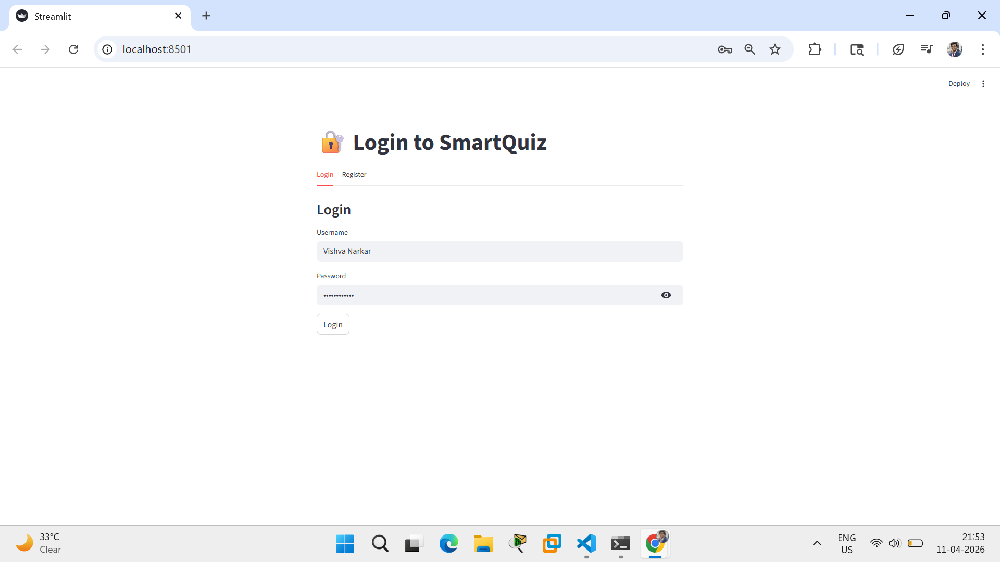
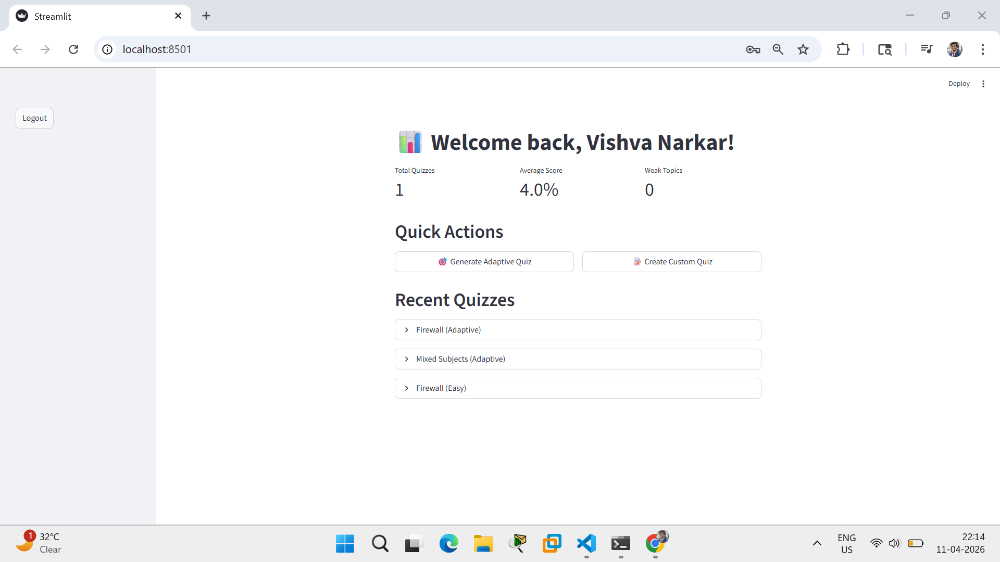
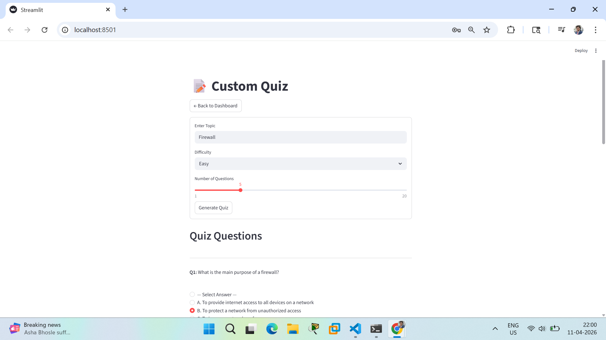
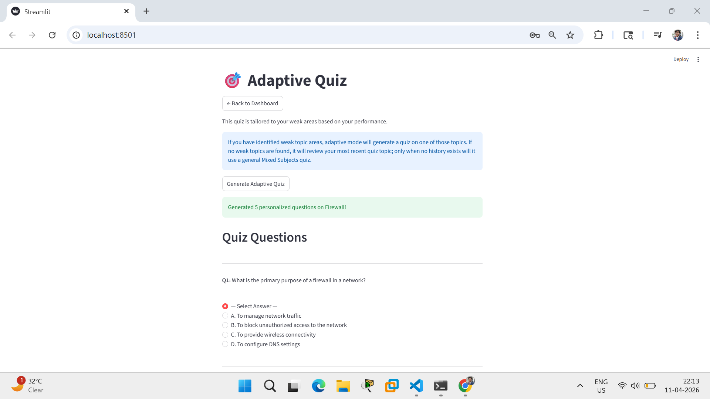
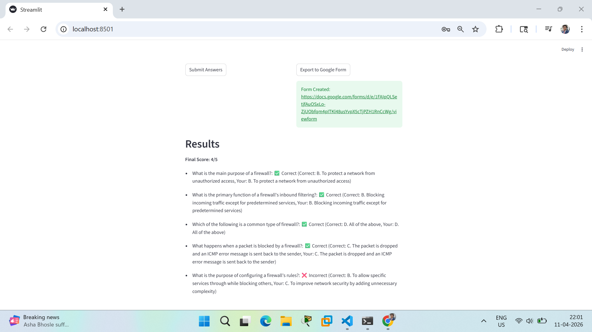
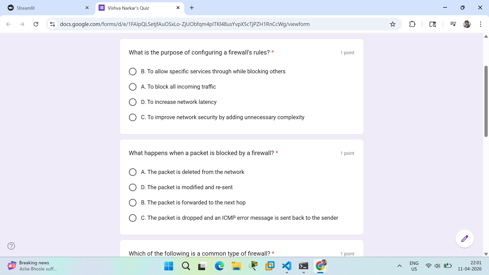

# 🧠 SmartQuiz Agent

An AI-powered, adaptive quiz generation platform powered by local LLMs. Create personalized multiple-choice questions and export to Google Forms with automatic grading and analytics.

## ✨ Features

- 🤖 **AI-Powered Quiz Generation**: Generate custom MCQs on any topic with adjustable difficulty using Ollama
- 👥 **Multi-User System**: User authentication, personalized dashboards, and progress tracking
- 🎯 **Adaptive Learning Engine**: Detects weak topics and generates targeted quizzes
- 📊 **Advanced Analytics**: View performance metrics, topic strengths/weaknesses, and learning progress
- 📝 **Interactive Web Interface**: Beautiful Streamlit-based UI with real-time quiz taking
- ✅ **Automatic Validation & Scoring**: Instant feedback with detailed answer analysis
- 📤 **Google Forms Export**: Export quizzes with answer keys and auto-grading enabled
- 💾 **Persistent Storage**: Quiz history, user profiles, and analytics automatically saved
- 🔐 **Secure Authentication**: Bcrypt-hashed passwords and user data privacy
- 🧩 **Clear Service Layer**: UI communicates through `services/api.py` for business logic separation

## 📸 Screenshots

### 🔐 User Authentication


### 📊 Dashboard


### 🧠 Quiz Generation


### 🎯 Adaptive Quiz


### ✅ Results & Analysis


### 📤 Google Forms Output


## 📋 Prerequisites

- **Python** 3.8 or higher
- **Ollama** - Local LLM engine (download from [ollama.ai](https://ollama.ai))
- **Google Cloud Account** - For Forms API integration (optional for exporting)

## 🚀 Installation

### Step 1: Clone the Repository
```bash
git clone <repository-url>
cd smartquiz-agent
```

### Step 2: Set Up Python Virtual Environment
```bash
python -m venv .venv
# On Windows:
.venv\Scripts\activate
# On macOS/Linux:
source .venv/bin/activate
```

### Step 3: Install Dependencies
```bash
python -m pip install -r requirements.txt
```
> Key dependencies include: streamlit, bcrypt, google-api-python-client, requests, python-dotenv, and ollama-related libraries.

### Step 4: Configure Environment
```bash
cp .env.example .env
# Edit .env with your settings
```

### Step 5: Set Up Ollama
```bash
# Download: https://ollama.ai
# Pull the model:
ollama pull llama3.1:8b
# Start the server:
ollama serve
```

### Step 6: (Optional) Set Up Google Forms API
1. Go to [Google Cloud Console](https://console.cloud.google.com/)
2. Create a new project
3. Enable **Google Forms API**
4. Create OAuth 2.0 credentials (Desktop app type)
5. Download `credentials.json` and place in `auth/` directory

> ⚠️ Never commit `credentials.json` to version control!
> 📖 See [CREDENTIALS_RECOVERY.md](CREDENTIALS_RECOVERY.md) if you need to regenerate these files

## 📖 Usage

### Launch the Application
```bash
streamlit run ui/streamlit_app.py
```
Open your browser to `http://localhost:8501`

### User Workflow
1. **Register/Login** - Create account or sign in
2. **Choose Quiz Type**:
   - 🎯 **Adaptive Quiz** - AI generates targeted questions on your weak topics
   - 📝 **Custom Quiz** - Create quiz on any topic with desired difficulty
3. **Take Quiz** - Answer questions with real-time feedback
4. **View Results** - See scores and recommendations
5. **Export** - Share quizzes to Google Forms with auto-grading
6. **Analytics** - Track progress in your dashboard

## 📁 Project Structure

```
smartquiz-agent/
├── 📄 config.py              # Configuration & environment settings
├── 📄 requirements.txt       # Python dependencies
├── 📄 .env.example          # Environment variables template
├── 📄 LICENSE               # MIT License
├── 📄 README.md             # This file
├── 🖼️ assets/
│   └── screenshots/         # README screenshot images
│
├── 🔐 auth/
│   ├── auth.py              # Google OAuth 2.0 authentication
│   └── credentials.json     # ⚠️ Google API credentials (gitignored)
│
├── 🧠 core/
│   ├── generator.py         # AI-powered MCQ generation
│   ├── validator.py         # Question validation & normalization
│   └── formatter.py         # JSON extraction & cleaning
│
├── 💾 data/
│   ├── data_manager.py      # Quiz persistence layer
│   ├── quizzes.json         # Shared quiz history
│   ├── users.json           # ⚠️ User profiles (gitignored)
│   └── quiz_history.json    # ⚠️ User quiz history (gitignored)
│
├── ⚙️ services/
│   ├── api.py               # UI-facing service API wrapper
│   ├── ai_service.py        # LLM request orchestration and caching
│   ├── user_manager.py      # User authentication & profiles
│   ├── adaptive_engine.py   # Adaptive learning intelligence
│   ├── form_creator.py      # Google Forms API integration
│   └── scoring.py           # Answer evaluation & analytics
│
├── 🎨 ui/
│   └── streamlit_app.py     # Multi-page Streamlit web interface
│
└── 🧪 tests/ (optional)
    └── test_core.py         # Unit tests    
```

## ⚙️ Configuration

Edit `config.py` or set environment variables in `.env`:

```env
OLLAMA_URL=http://localhost:11434/api/generate
OLLAMA_MODEL=llama3.1:8b
OLLAMA_TIMEOUT=300
DEFAULT_NUM_QUESTIONS=5
MAX_NUM_QUESTIONS=20
GOOGLE_SCOPES=https://www.googleapis.com/auth/forms.body
```

Key settings:
- **OLLAMA_URL**: Local Ollama API endpoint
- **OLLAMA_MODEL**: LLM model to use (default: llama3.1:8b)
- **OLLAMA_TIMEOUT**: Request timeout in seconds (default: 300)
- **MAX_NUM_QUESTIONS**: Maximum questions per quiz (default: 20)

## 👨‍💻 Development

### Running Tests
```bash
python -m pip install pytest
pytest tests/
```
> Tests cover core functionality including MCQ validation, user registration/login, analytics, and mocked quiz generation.

### Code Quality & Linting
```bash
# Install tools
pip install flake8 black pylint

# Lint
flake8 .
pylint **/*.py

# Format
black .
```

### Project Architecture
- **Core Engine**: Quiz generation & validation
- **Services Layer**: `services/api.py` API wrapper plus user management, adaptive AI, and Google Forms integration
- **UI Layer**: Streamlit web interface with multi-page support
- **Data Layer**: JSON-based persistence with user-specific storage

## 🚢 Deployment

### Local Docker
```bash
docker build -t smartquiz-agent .
docker run -p 8501:8501 smartquiz-agent
```

### Cloud Deployment Options
- **☁️ Streamlit Cloud**: Push to GitHub, deploy directly
- **AWS**: ECS + ECR containerization
- **GCP**: Cloud Run + Cloud Build
- **Azure**: App Service + Container Registry
- **Heroku**: Docker-based deployment

> 📌 **Note**: For production, use cloud LLM APIs or manage Ollama infrastructure separately

## 🔐 Security Best Practices

✅ **What's Protected**:
- `auth/credentials.json` - Google API credentials
- `auth/token.json` - OAuth tokens
- `data/users.json` - User profiles with bcrypt-hashed passwords
- `data/quiz_history.json` - User quiz data
- `.env` - Environment variables

✅ **Guidelines**:
- Passwords are bcrypt-hashed for stronger password security
- Never commit sensitive files (enforced by `.gitignore`)
- Use environment variables for configuration
- Validate all user inputs
- Rotate Google API credentials regularly
- Review `.gitignore` before deploying

## 🤝 Contributing

1. 🍴 Fork the repository
2. 🌿 Create a feature branch (`git checkout -b feature/amazing-feature`)
3. ✏️ Make your changes
4. 🧪 Add tests and verify
5. 📤 Submit a pull request

**Areas for Contribution**:
- 🚀 Performance optimizations
- 🎨 UI/UX improvements
- 📚 Additional LLM support
- 🧪 Test coverage
- 📖 Documentation

## 📜 License

MIT License © 2026 - See [LICENSE](LICENSE) file for details

## 🐛 Troubleshooting

### 🤖 Ollama Issues
| Problem | Solution |
|---------|----------|
| Connection refused | Run `ollama serve` in another terminal |
| Model not found | Run `ollama pull llama3.1:8b` |
| Slow generation | Increase timeout in `.env` (OLLAMA_TIMEOUT) |
| Out of memory | Use smaller model: `ollama pull llama2` |

### 🔐 Google API Issues
| Problem | Solution |
|---------|----------|
| credentials.json not found | Download from Google Cloud Console |
| API not enabled | Enable Forms API in Google Cloud |
| Token expired | Delete `auth/token.json` and re-authenticate |

### 💥 Common Errors
| Error | Fix |
|-------|-----|
| `Ollama API Error: 500` | Check Ollama is running with sufficient resources |
| `Failed to create form` | Verify Google credentials and API permissions |
| `Login failed` | Verify username/password; check users.json exists |
| `Quiz generation timeout` | Increase OLLAMA_TIMEOUT or reduce num_questions |

### 🆘 Getting Help
- Check GitHub Issues
- Review logs in terminal
- Verify all prerequisites are installed
- Ensure ports 8501 (Streamlit) and 11434 (Ollama) are available